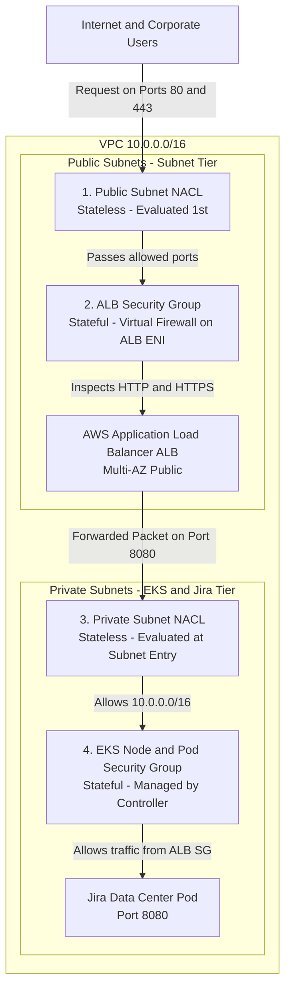
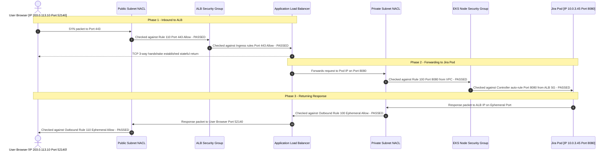

# AWS EKS & ALB Security Layer: Security Groups & NACLs Guide

This comprehensive guide explains the **two-layer perimeter defense** (Network ACLs and Security Groups) for an AWS Application Load Balancer (ALB) provisioned dynamically by the **AWS Load Balancer Controller** in Amazon EKS.

---

## Table of Contents
1. [Defense-in-Depth Architecture](#1-defense-in-depth-architecture)
2. [Security Groups vs. NACLs: Core Differences](#2-security-groups-vs-nacls-core-differences)
3. [Layer 1: Security Groups (Stateful ENI Layer)](#3-layer-1-security-groups-stateful-eni-layer)
   - [Default Controller Behavior](#default-controller-behavior)
   - [Option A: Inbound CIDR Whitelisting via Ingress](#option-a-inbound-cidr-whitelisting-via-ingress)
   - [Option B: Pre-created Terraform Security Group (Recommended)](#option-b-pre-created-terraform-security-group-recommended)
   - [How ALB-to-Pod Backend Traffic is Secured](#how-alb-to-pod-backend-traffic-is-secured)
4. [Layer 2: Network ACLs (Stateless Subnet Layer)](#4-layer-2-network-acls-stateless-subnet-layer)
   - [Why Ephemeral Ports Matter](#why-ephemeral-ports-matter)
   - [Public Subnet NACL Rules (ALB Tier)](#public-subnet-nacl-rules-alb-tier)
   - [Private Subnet NACL Rules (Worker Node / Pod Tier)](#private-subnet-nacl-rules-worker-node--pod-tier)
5. [End-to-End Packet Flow Example](#5-end-to-end-packet-flow-example)
6. [Common Troubleshooting & Gotchas](#6-common-troubleshooting--gotchas)

---

## 1. Defense-in-Depth Architecture

Traffic entering your AWS VPC must pass through **two distinct security filters** before reaching Jira Data Center pods:



---

## 2. Security Groups vs. NACLs: Core Differences

| Feature | Network ACL (NACL) | Security Group (SG) |
|:---|:---|:---|
| **Operating Boundary** | **Subnet Level** (Applies to all resources in subnet) | **Network Interface (ENI) Level** (Applies to individual ALB / EC2 instance) |
| **State Nature** | **Stateless**: Return traffic must be explicitly allowed. | **Stateful**: Return traffic is automatically allowed. |
| **Rule Processing** | **Numbered Order**: Evaluated top-down; stops at first match. | **All Rules Evaluated**: Evaluated simultaneously before decision. |
| **Allow / Deny** | Supports both **ALLOW** and **DENY** rules. | Supports **ALLOW** rules only (implicit deny all else). |
| **Evaluation Order** | Evaluated **FIRST** when packet enters subnet. | Evaluated **SECOND** after packet passes NACL. |
| **Ephemeral Ports** | **Required** for return connections (`1024-65535`). | **Not required** (stateful tracking handles it). |

---

## 3. Layer 1: Security Groups (Stateful ENI Layer)

### Default Controller Behavior
When you deploy an Ingress with `className: alb` without custom settings:
1. The AWS Load Balancer Controller creates a dedicated AWS Security Group named `k8s-traffic-<hash>`.
2. It adds inbound rules allowing `0.0.0.0/0` on listener ports (`80` and/or `443`).
3. It automatically updates your **EKS Cluster Shared Security Group** or **Node Security Group** to authorize incoming traffic from this new ALB SG.

---

### Option A: Inbound CIDR Whitelisting via Ingress
If you want to restrict public access to your corporate VPN, office IP ranges, or CloudFront IPs without managing a custom SG in Terraform, use the `inbound-cidrs` annotation:

```yaml
# In your Jira Ingress values.yaml
ingress:
  annotations:
    alb.ingress.kubernetes.io/scheme: internet-facing
    # Restrict to specific IP blocks (comma-separated):
    alb.ingress.kubernetes.io/inbound-cidrs: "106.51.0.0/16, 49.207.0.0/16, 203.0.113.50/32"
```

---

### Option B: Pre-created Terraform Security Group (Recommended for Production)
In enterprise environments, security groups are strictly audited and managed by Infrastructure-as-Code (Terraform).

#### 1. Define the ALB Security Group in Terraform
Add this to your Terraform code (e.g. `security/main.tf`):

```hcl
resource "aws_security_group" "alb_sg" {
  name        = "${var.project}-${var.env}-alb-sg"
  description = "Security group for Jira Data Center ALB"
  vpc_id      = var.vpc_id

  # Inbound HTTPS (Port 443)
  ingress {
    description = "Allow HTTPS from trusted networks"
    from_port   = 443
    to_port     = 443
    protocol    = "tcp"
    cidr_blocks = ["0.0.0.0/0"] # Replace with corporate/VPN CIDRs if private
  }

  # Inbound HTTP (Port 80)
  ingress {
    description = "Allow HTTP"
    from_port   = 80
    to_port     = 80
    protocol    = "tcp"
    cidr_blocks = ["0.0.0.0/0"]
  }

  # Outbound Egress to VPC / Worker Nodes
  egress {
    description = "Allow all outbound traffic to worker nodes"
    from_port   = 0
    to_port     = 0
    protocol    = "-1"
    cidr_blocks = ["0.0.0.0/0"]
  }

  tags = {
    Name = "${var.project}-${var.env}-alb-sg"
  }
}

output "alb_security_group_id" {
  value = aws_security_group.alb_sg.id
}
```

#### 2. Attach the SG to the ALB in `jira-values.yaml`
Pass the created Security Group ID into the Ingress annotations:

```yaml
ingress:
  create: true
  className: "alb"
  annotations:
    alb.ingress.kubernetes.io/scheme: internet-facing
    # Attach your Terraform-managed Security Group:
    alb.ingress.kubernetes.io/security-groups: sg-0123456789abcdef0
```

---

### How ALB-to-Pod Backend Traffic is Secured

When using `alb.ingress.kubernetes.io/target-type: ip` (the AWS EKS standard):
* Traffic routes **directly from the ALB ENI to the Pod's VPC IP address** (bypassing NodePort and `kube-proxy`).
* The AWS Load Balancer Controller reads the Pod's port (`8080` for Jira) and **automatically injects** an inbound rule into the EKS worker node security group:
  ```text
  Type: Custom TCP
  Port Range: 8080
  Source: <ALB-Security-Group-ID>
  Description: "elbv2.k8s.aws/targetGroupBinding=..."
  ```
* When the Ingress or Helm release is deleted, the controller cleanly removes this rule.

---

## 4. Layer 2: Network ACLs (Stateless Subnet Layer)

### Why Ephemeral Ports Matter in NACLs
Because NACLs are **stateless**, they do **not** remember connections:
* When a user connects to port `443` on the ALB, their browser opens a random **ephemeral client port** (e.g., `51234`).
* When the ALB sends the response back to the user, the packet leaves on destination port `51234`.
* **If your Outbound NACL does not allow ephemeral ports (`1024-65535`), the response packet is dropped!**

---

### Public Subnet NACL Rules (Where the ALB Lives)

#### Inbound Rules (Public Subnet)

| Rule # | Type | Protocol | Port Range | Source | Purpose |
|:---:|:---|:---:|:---:|:---:|:---|
| **100** | HTTP | TCP | `80` | `0.0.0.0/0` | User web requests. |
| **110** | HTTPS | TCP | `443` | `0.0.0.0/0` | Secure user web requests. |
| **120** | Custom TCP | TCP | `1024 - 65535` | `10.0.0.0/16` | **Ephemeral return traffic** from Jira Pods in private subnets. |
| **\*** | ALL | ALL | ALL | `0.0.0.0/0` | Default Deny. |

#### Outbound Rules (Public Subnet)

| Rule # | Type | Protocol | Port Range | Destination | Purpose |
|:---:|:---|:---:|:---:|:---:|:---|
| **100** | Custom TCP | TCP | `8080` | `10.0.0.0/16` | Forward user requests to Jira pods in private subnets. |
| **110** | Custom TCP | TCP | `1024 - 65535` | `0.0.0.0/0` | **Ephemeral return traffic** back to user web browsers. |
| **\*** | ALL | ALL | ALL | `0.0.0.0/0` | Default Deny. |

---

### Private Subnet NACL Rules (Where Jira Worker Nodes Live)

#### Inbound Rules (Private Subnet)

| Rule # | Type | Protocol | Port Range | Source | Purpose |
|:---:|:---|:---:|:---:|:---:|:---|
| **100** | Custom TCP | TCP | `8080` | `10.0.0.0/16` | Inbound requests forwarded from ALB public subnets. |
| **110** | Custom TCP | TCP | `1024 - 65535` | `0.0.0.0/0` | Return traffic from NAT Gateway (for container pulls, OS updates). |
| **\*** | ALL | ALL | ALL | `0.0.0.0/0` | Default Deny. |

#### Outbound Rules (Private Subnet)

| Rule # | Type | Protocol | Port Range | Destination | Purpose |
|:---:|:---|:---:|:---:|:---:|:---|
| **100** | Custom TCP | TCP | `1024 - 65535` | `10.0.0.0/16` | Return HTTP response packets back to the ALB. |
| **110** | PostgreSQL | TCP | `5432` | `10.0.0.0/16` | Database queries to Aurora PostgreSQL cluster. |
| **120** | NFS | TCP | `2049` | `10.0.0.0/16` | Shared Home file I/O to Amazon EFS. |
| **130** | HTTPS | TCP | `443` | `0.0.0.0/0` | Outbound calls via NAT Gateway (AWS APIs, container registries). |
| **\*** | ALL | ALL | ALL | `0.0.0.0/0` | Default Deny. |

---

## 5. End-to-End Packet Flow Example

Here is how a real user request travels through both security layers:



---

## 6. Common Troubleshooting & Gotchas

### 1. Browser shows `ERR_CONNECTION_TIMED_OUT`
* **Likely Cause**: Missing Outbound ephemeral ports on Public Subnet NACL (`Rule 110: 1024-65535 -> 0.0.0.0/0`).
* **Why**: The request reached the ALB, but the ALB's response packets back to the browser were dropped by the subnet's stateless outbound rule.

### 2. ALB returns `504 Gateway Timeout`
* **Likely Cause**: Security Group or NACL misconfiguration between ALB and EKS worker nodes.
* **Checks**:
  1. Does the Private Subnet NACL allow inbound traffic on port `8080` from `10.0.0.0/16`?
  2. Does the EKS Node Security Group have an ingress rule from the ALB Security Group on port `8080`?

### 3. ALB returns `502 Bad Gateway`
* **Likely Cause**: Jira container is crashing or not listening on port `8080` (e.g. JVM `OOMKilled` or database connection failure).
* **Checks**: Run `kubectl logs -n jira jira-0` and verify the health check path (`/status` or `/`).

### 4. Custom Security Group Overwrites
* **Warning**: If you specify `alb.ingress.kubernetes.io/security-groups`, the controller will **only** attach the security group(s) you list. Make sure your custom SG includes both `80`/`443` ingress AND all-traffic egress so it can reach the worker nodes!
