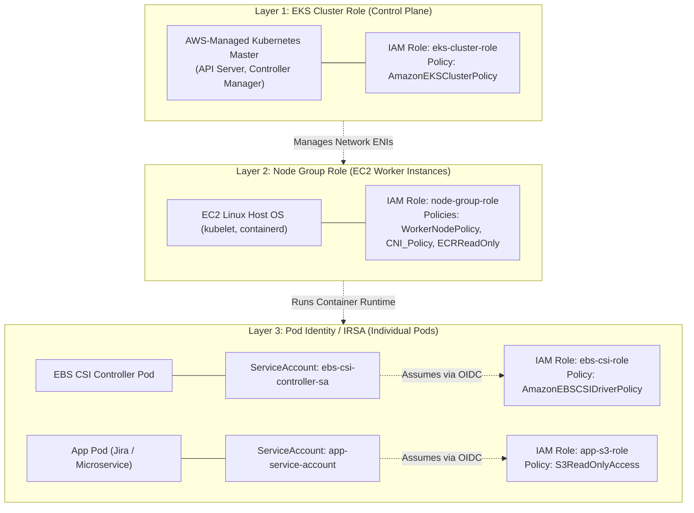
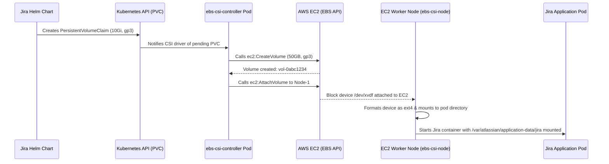
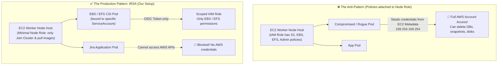
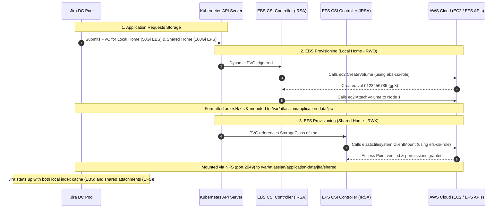
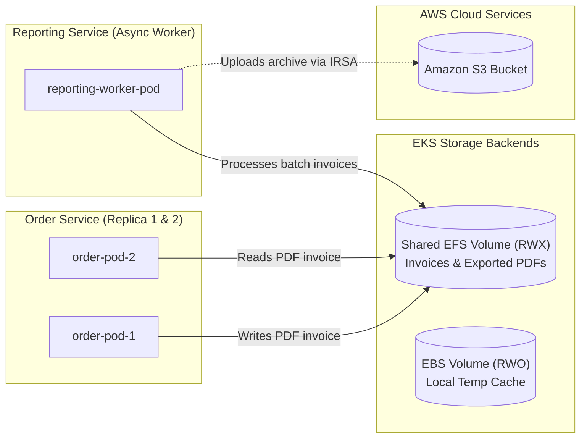
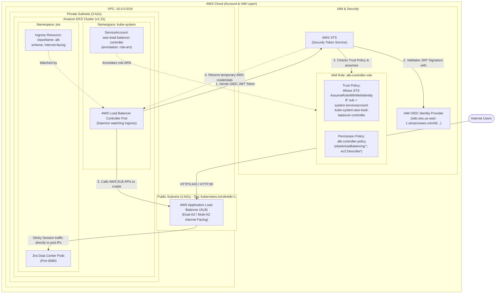
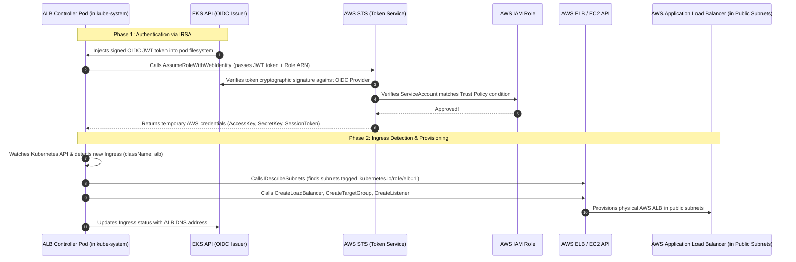

# Amazon EKS: Storage (EBS / EFS) & IAM Security (IRSA / OIDC) Deep Dive

This comprehensive technical guide explains how **Kubernetes Storage** and **AWS IAM Authentication** function under the hood in Amazon EKS, applicable both to **Jira Data Center** and modern **Microservices Architectures**.

---

## Table of Contents
1. [The 3 Layers of IAM Permissions in Amazon EKS](#1-the-3-layers-of-iam-permissions-in-amazon-eks)
2. [What is a Kubernetes ServiceAccount & Why Does It Need OIDC?](#2-what-is-a-kubernetes-serviceaccount--why-does-it-need-oidc)
3. [The Anatomy of IRSA (IAM Roles for Service Accounts)](#3-the-anatomy-of-irsa-iam-roles-for-service-accounts)
4. [EKS Add-ons: What is the EBS CSI Driver Doing?](#4-eks-add-ons-what-is-the-ebs-csi-driver-doing)
5. [Connecting AWS EFS to Kubernetes: Where Are Mount Points Referenced?](#5-connecting-aws-efs-to-kubernetes-where-are-mount-points-referenced)
6. [Architectural Comparison: EBS (Block/RWO) vs. EFS (Network/RWX)](#6-architectural-comparison-ebs-blockrwo-vs-efs-networkrwx)
7. [IAM Roles Importance in EBS & EFS: Security & Architecture](#7-iam-roles-importance-in-ebs--efs-security--architecture)
8. [Microservices Reference Pattern](#8-microservices-reference-pattern)
9. [Ingress & AWS Load Balancer Controller: IRSA Handshake & ALB Provisioning](#9-ingress--aws-load-balancer-controller-irsa-handshake--alb-provisioning)

---

## 1. The 3 Layers of IAM Permissions in Amazon EKS

When building an EKS cluster, you encounter three completely different IAM roles. Confusing these three is the #1 mistake engineers make.



### Breakdown of the 3 Layers

| Layer | Who Assumes It? | AWS Entity | Example Responsibilities | What Happens If You Misuse It? |
| :--- | :--- | :--- | :--- | :--- |
| **1. Control Plane** | AWS EKS service (`eks.amazonaws.com`) | `aws_iam_role.eks_role` | Creates cross-account VPC ENIs to reach worker nodes; attaches AWS Classic/Application Load Balancers. | Pods and worker nodes cannot use this role. |
| **2. EC2 Node Group** | The EC2 VM host OS (`ec2.amazonaws.com`) | `aws_iam_role.node_group_role` | Allows the EC2 VM to register to the cluster API (`kubelet`), pull images from ECR, and assign VPC IP addresses to pods via AWS VPC CNI. | **If you add S3/EBS policies here**, *every single pod* on the node inherits full AWS admin access via the EC2 metadata IP (`169.254.169.254`). |
| **3. Pod Level (IRSA)** | An individual container pod | Bound to a Kubernetes `ServiceAccount` via OIDC | Allows only the designated pod to call AWS APIs (e.g., EBS volume creation, S3 uploads, DynamoDB queries). | Secure, granular, least-privilege access per microservice. |

---

## 2. What is a Kubernetes ServiceAccount & Why Does It Need OIDC?

### What is a ServiceAccount in Kubernetes?
In Kubernetes:
* **Users** (like developers using `kubectl`) are authenticated externally.
* **Processes inside Pods** need an identity to talk to the Kubernetes API server (to inspect pods, configmaps, etc.). That identity is called a **`ServiceAccount`**.
* Every Kubernetes namespace has a `default` ServiceAccount. When a pod starts, Kubernetes automatically mounts a cryptographic token into the pod at:
  `/var/run/secrets/kubernetes.io/serviceaccount/token`

### The Problem: AWS Doesn't Know Kubernetes
* Kubernetes knows what a `ServiceAccount` is.
* **AWS IAM has zero knowledge of Kubernetes objects**. If a pod calls an AWS API (like `ec2:CreateVolume`), AWS says: *"Who are you? I only understand IAM Users and IAM Roles."*

### The Bridge: OpenID Connect (OIDC)
**OIDC is an open standard for identity verification.**
When you create an EKS cluster, AWS turns the cluster into an **OpenID Connect Identity Provider**.
1. EKS signs a JSON Web Token (JWT) for the pod's `ServiceAccount`.
2. The pod sends this token to **AWS STS** (Security Token Service).
3. AWS STS checks the **OIDC Provider** you created in Terraform:
   ```hcl
   resource "aws_iam_openid_connect_provider" "eks" { ... }
   ```
4. AWS says: *"I trust this EKS cluster's cryptographic signature. The token proves this pod is `system:serviceaccount:kube-system:ebs-csi-controller-sa`. I will temporarily grant it the IAM role."*

---

## 3. The Anatomy of IRSA (IAM Roles for Service Accounts)

Here is what happens when you write this block in [main.tf](file:///e:/GitRepos/interview/jira-dc-eks-rds-setup/main.tf):

```hcl
resource "aws_iam_role" "ebs_csi_role" {
  name = "jira-dc-dev-ebs-csi-role"

  assume_role_policy = jsonencode({
    Version = "2012-10-17"
    Statement = [{
      Action = "sts:AssumeRoleWithWebIdentity"
      Effect = "Allow"
      Principal = {
        Federated = module.oidc.oidc_provider_arn
      }
      Condition = {
        StringEquals = {
          "${module.oidc.oidc_provider_url}:sub" = "system:serviceaccount:kube-system:ebs-csi-controller-sa"
          "${module.oidc.oidc_provider_url}:aud" = "sts.amazonaws.com"
        }
      }
    }]
  })
}
```

### Dissecting the Trust Policy:
* **`sts:AssumeRoleWithWebIdentity`**: Tells AWS that this role is not assumed with a password or secret key, but with an **OIDC Web Token**.
* **`Federated = module.oidc.oidc_provider_arn`**: Tells AWS to only accept tokens issued by **your specific EKS cluster**.
* **`StringEquals ... :sub`**: **The security lock.**
  * `sub` stands for **Subject**.
  * It guarantees that **ONLY** a pod running in the `kube-system` namespace with the ServiceAccount named `ebs-csi-controller-sa` can assume this role.
  * Your Jira application pod in the `jira` namespace **cannot** assume this role because its subject will be `system:serviceaccount:jira:jira-sa`!

---

## 4. EKS Add-ons: What is the EBS CSI Driver Doing?

In [main.tf](file:///e:/GitRepos/interview/jira-dc-eks-rds-setup/main.tf), you wrote:

```hcl
resource "aws_eks_addon" "ebs_csi" {
  cluster_name             = "jira-dc-dev-eks-cluster"
  addon_name               = "aws-ebs-csi-driver"
  service_account_role_arn = aws_iam_role.ebs_csi_role.arn
}
```

### What does this resource actually execute?
When Terraform calls the AWS API to create this add-on:
1. AWS reaches inside your Kubernetes cluster's `kube-system` namespace.
2. It automatically creates a Kubernetes `ServiceAccount`:
   ```yaml
   apiVersion: v1
   kind: ServiceAccount
   metadata:
     name: ebs-csi-controller-sa
     namespace: kube-system
     annotations:
       eks.amazonaws.com/role-arn: arn:aws:iam::123456789012:role/jira-dc-dev-ebs-csi-role
   ```
3. AWS deploys two Kubernetes workloads:
   * **`ebs-csi-controller` (Deployment)**: A control loop that calls AWS EC2 APIs (`CreateVolume`, `DeleteVolume`, `AttachVolume`).
   * **`ebs-csi-node` (DaemonSet)**: Runs on every EC2 worker node to format the raw block device (`ext4`/`xfs`) and mount it to the pod's directory.

### The Lifecycle in Action:


---

## 5. Connecting AWS EFS to Kubernetes: Where Are Mount Points Referenced?

You asked: *"We are creating EFS mount points in Terraform, but where do we actually reference them?"*

### The Missing Mental Link: Terraform vs. Kubernetes
* **Terraform's job**: Creates the AWS physical infrastructure (the EFS file system and the Mount Target ENIs in your 3 private subnets).
* **Kubernetes's job**: Connects containers to that infrastructure via a **StorageClass** and **PersistentVolume (PV)**.

### Where is EFS Referenced? (The 3 Connection Steps)

#### Step 1: In Terraform (Outputs)
Terraform outputs the unique AWS EFS File System ID in [efs/output.tf](file:///e:/GitRepos/interview/jira-dc-eks-rds-setup/efs/output.tf):
```hcl
output "efs_file_system_id" {
  value = aws_efs_file_system.jira_dc_efs.id # e.g. fs-0123456789abcdef0
}
```

#### Step 2: In Kubernetes (StorageClass Definition)
After Terraform finishes, you apply a Kubernetes `StorageClass` YAML that references that File System ID:
```yaml
# efs-storageclass.yaml
apiVersion: storage.k8s.io/v1
kind: StorageClass
metadata:
  name: efs-sc
provisioner: efs.csi.aws.com
parameters:
  provisioningMode: efs-ap
  fileSystemId: fs-0123456789abcdef0  # <--- HERE IS WHERE EFS IS REFERENCED!
  directoryPerms: "700"
```

#### Step 3: In the Application Helm Chart (`values.yaml`)
In your Jira Data Center `values.yaml`, you tell Jira to use that StorageClass for shared home:
```yaml
# jira-values.yaml
jira:
  sharedHome:
    customVolume:
      persistentVolumeClaim:
        claimName: jira-shared-home-pvc
    persistentVolumeClaim:
      create: true
      storageClassName: efs-sc         # <--- Tells Jira to use the EFS StorageClass
      resources:
        requests:
          storage: 100Gi
```

### Why didn't we specify Mount Target Subnet IPs in Kubernetes?
**You never need to specify the Mount Target IPs in Kubernetes.**
The **AWS EFS CSI Driver** automatically queries AWS:
1. It detects which Availability Zone the Jira pod is running in (e.g. `us-east-1a`).
2. It looks up the EFS Mount Target that Terraform created in `us-east-1a`.
3. It mounts using the local AZ mount target automatically!

---

## 6. Architectural Comparison: EBS (Block/RWO) vs. EFS (Network/RWX)

| Feature | Amazon EBS (`gp3`) | Amazon EFS |
| :--- | :--- | :--- |
| **Storage Architecture** | Direct Block Storage (Virtual SSD) | Network File System (NFSv4) |
| **Kubernetes Access Mode** | **`ReadWriteOnce` (RWO)**<br>Can only be mounted by **one single node** at a time. | **`ReadWriteMany` (RWX)**<br>Can be mounted by **dozens of pods across multiple nodes** simultaneously. |
| **Provisioning Model** | **Dynamic**: Created on-demand by the EBS CSI Driver when a PVC is requested. | **Static / Pre-provisioned**: The filesystem and mount targets are created by Terraform upfront. |
| **Speed / Latency** | Ultra-fast (< 1 ms latency). High IOPS. | Fast network file I/O (1–5 ms latency). Bursting or provisioned throughput. |
| **Jira DC Usage** | `jira-local-home`<br>(Lucene search indexes, local node cache, process logs). | `jira-shared-home`<br>(File attachments, avatars, plugin jars, cluster locks). |
| **Microservices Usage** | Single-replica databases (MySQL, MongoDB, Redis state). | Shared media, user document uploads, static web assets shared across replicas. |

---

## 7. IAM Roles Importance in EBS & EFS: Security & Architecture

Kubernetes pods live inside a virtual container sandbox. By default, **Kubernetes has zero authority to create or attach AWS infrastructure**.

### Architecture: How CSI Drivers Use IAM Roles

```mermaid
flowchart TB
    subgraph AWS_IAM ["AWS IAM & Security Layer"]
        OIDC["EKS OIDC Identity Provider\n(oidc.eks.us-east-1.amazonaws.com/id/...)"]
        
        subgraph IAM_Roles ["Dedicated IRSA IAM Roles"]
            EBS_Role["IAM Role: ebs-csi-role\nPolicy: AmazonEBSCSIDriverPolicy\n(ec2:CreateVolume, ec2:AttachVolume)"]
            EFS_Role["IAM Role: efs-csi-role\nPolicy: AmazonEFSCSIDriverPolicy\n(elasticfilesystem:ClientMount, ClientWrite)"]
        end
    end

    subgraph AWS_Storage ["AWS Managed Storage Services"]
        EBS_Vol[("Amazon EBS Volume (gp3)\nBlock Storage - Fast I/O\nAccess: ReadWriteOnce (RWO)")]
        EFS_FS[("Amazon EFS File System\nNFS Network Storage\nAccess: ReadWriteMany (RWX)")]
    end

    subgraph EKS_Cluster ["Amazon EKS Cluster"]
        subgraph Kube_System ["Namespace: kube-system (CSI Control Plane)"]
            subgraph EBS_CSI ["AWS EBS CSI Controller"]
                SA_EBS["ServiceAccount: ebs-csi-controller-sa\n(annotation: ebs-csi-role ARN)"]
                Pod_EBS["EBS CSI Controller Pod"]
            end

            subgraph EFS_CSI ["AWS EFS CSI Controller"]
                SA_EFS["ServiceAccount: efs-csi-controller-sa\n(annotation: efs-csi-role ARN)"]
                Pod_EFS["EFS CSI Controller Pod"]
            end
        end

        subgraph Worker_Nodes ["EKS Worker Nodes (m5.xlarge)"]
            subgraph Node1 ["Worker Node 1 (AZ-a)"]
                JiraPod1["Jira Pod 1"]
            end
            subgraph Node2 ["Worker Node 2 (AZ-b)"]
                JiraPod2["Jira Pod 2"]
            end
        end
    end

    %% OIDC IRSA Handshake
    SA_EBS -.->|1. Assumes role via OIDC| EBS_Role
    SA_EFS -.->|1. Assumes role via OIDC| EFS_Role

    %% Control Plane AWS API Calls (Requiring IAM)
    Pod_EBS ==>|2. Calls EC2 API to Create & Attach volume| EBS_Vol
    Pod_EFS ==>|2. Calls EFS API to Create Access Point| EFS_FS

    %% Mount / Data Plane (Physical Attachment)
    EBS_Vol -->|Attached to Node 1 only (RWO)| JiraPod1
    EFS_FS -.->|NFS Port 2049 Mount (RWX)| JiraPod1
    EFS_FS -.->|NFS Port 2049 Mount (RWX)| JiraPod2
```

### Security Comparison: Node Role (Anti-Pattern) vs. IRSA (Best Practice)



### Step-by-Step Volume Lifecycle: From PVC to Mounted Disk



---

## 8. Microservices Reference Pattern

This exact same architecture applies to any modern microservices stack on EKS:



### The Universal EKS Security & Storage Rule:
1. **Infrastructure**: Provision VPC, Subnets, EKS, RDS, EFS, and OIDC with **Terraform**.
2. **Cluster Controllers**: Install CSI Drivers (`aws-ebs-csi-driver`, `aws-efs-csi-driver`) with **IRSA IAM roles** so they have permission to manipulate AWS storage.
3. **Application Pods**: Mount EBS for fast single-instance state (`RWO`) and EFS for multi-instance shared files (`RWX`). Use IRSA to grant pods access only to the AWS services (S3, SQS, DynamoDB) they specifically need.

---

## 9. Ingress & AWS Load Balancer Controller: IRSA Handshake & ALB Provisioning

Just like the CSI drivers need IAM permissions to manage storage, the **AWS Load Balancer Controller** needs IAM permissions to manage networking (ALBs, target groups, listeners).

### Architecture Topology Diagram



### The IRSA Handshake & Provisioning Sequence



### Component Breakdown
* **IAM Role (`alb_controller_role`)**: Has the Trust Policy scoped to the Controller's `ServiceAccount` and the Permission Policy granting ELB & EC2 permissions.
* **IAM OIDC Identity Provider**: Authenticates that the request originated from the EKS cluster.
* **AWS Load Balancer Controller**: The in-cluster brain watching for Kubernetes `Ingress` resources.
* **AWS ALB**: The physical Layer 7 load balancer in public subnets enforcing cookie-based sticky sessions for Jira Data Center.
