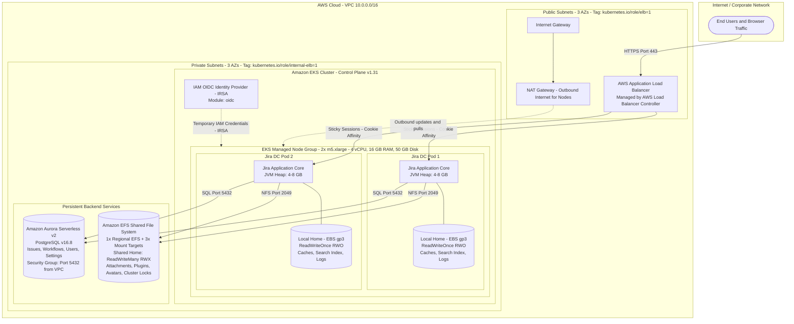
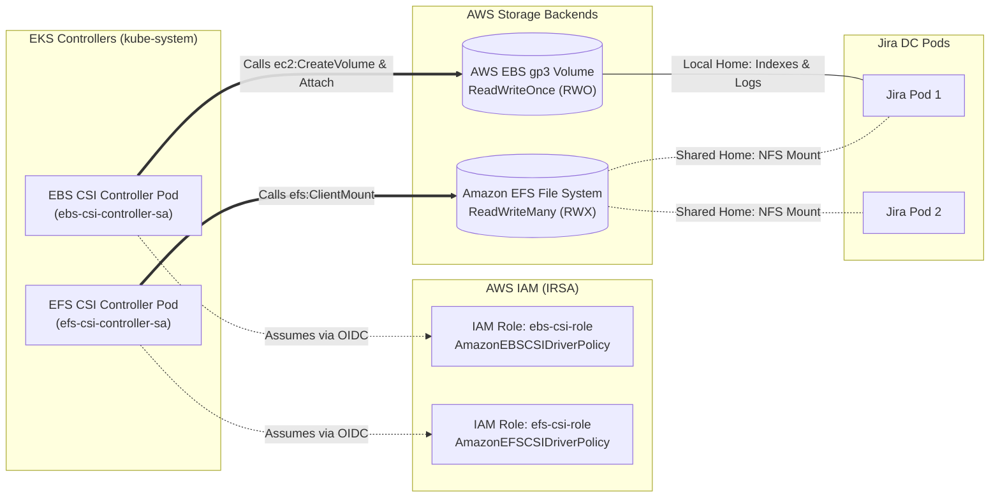
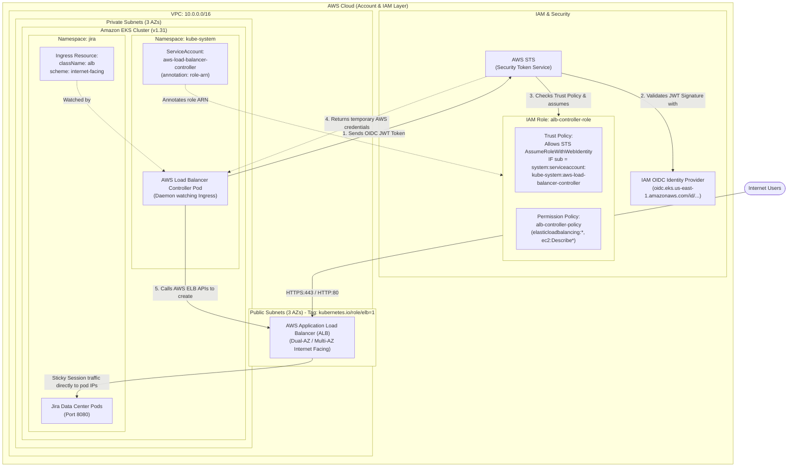
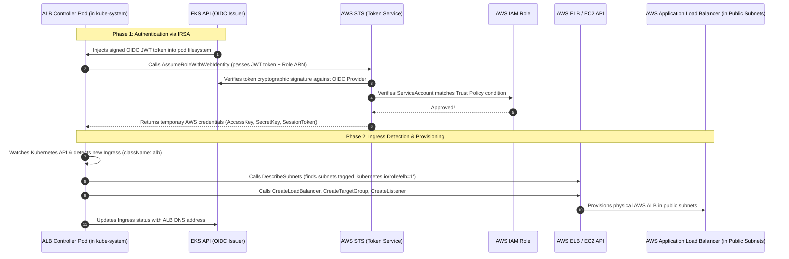

# Jira Data Center on AWS EKS & RDS Setup

Production-ready infrastructure architecture for deploying **Atlassian Jira Data Center** on **Amazon Elastic Kubernetes Service (EKS)** with **Amazon Aurora Serverless v2 PostgreSQL** and **Amazon EFS**.

---

## 1. Architecture Overview

Jira Data Center is an enterprise multi-node clustered application designed for high availability, fault tolerance, and load distribution. Unlike Jira Server, all cluster nodes (pods) run concurrently, requiring a shared relational database, shared file storage (`ReadWriteMany`), local block storage for indexing (`ReadWriteOnce`), and an Application Load Balancer with cookie-based sticky sessions.

### Architecture Diagram



---

## 2. Core Components Deep Dive

### 1. Worker Node Group (`m5.xlarge`) — Configured
* **Configuration**: `instance_types = ["m5.xlarge"]`, `disk_size = 50 GB`, `desired_size = 2` (min: 1, max: 3).
* **Why it matters**:
  * AWS EKS defaults to `t3.medium` (2 vCPUs, 4 GB RAM) if unspecified, which causes immediate pod crashes (**`OOMKilled`**) because Jira DC requires **4 GB to 8+ GB of RAM (Heap)** just for the JVM, plus system reserves for Kubernetes daemons (`kubelet`, `aws-node`, `coredns`).
  * `m5.xlarge` provides **4 vCPUs and 16 GiB RAM**, offering ample capacity for Jira's Lucene indexing, caches, and multiple cluster nodes.

### 2. Database: Amazon Aurora Serverless v2 PostgreSQL — Configured
* **Configuration**: PostgreSQL engine `16.8`, Serverless v2 capacity (`min: 0.5 ACU`, `max: 1.0 ACU`), `manage_master_user_password = true` (AWS Secrets Manager integration), and dedicated DB Subnet Group across private subnets.
* **Why it matters**:
  * Jira Data Center does not include an embedded database for production; all cluster nodes connect to the same central database.
  * Aurora Serverless v2 instantly scales compute capacity up and down without downtime and provides automated Multi-AZ replication.
  * Password credentials are securely generated and rotated by AWS Secrets Manager rather than plaintext in code.

### 3. Database Security Group (`security/` module) — Configured
* **Configuration**: `aws_security_group.rds_sg` with `ingress` on TCP port `5432` restricted to `var.vpc_cidr` (`10.0.0.0/16`), and stateful egress.
* **Why it matters**:
  * Prevents unauthorized access while ensuring all worker nodes inside the VPC private subnets can communicate with the Aurora database cluster endpoint.

### 4. Storage Architecture: Local Home vs. Shared Home
Jira Data Center strictly separates local instance data from cluster-shared data:

| Storage Type | Mount Path | AWS Service | Access Mode | Purpose |
| :--- | :--- | :--- | :--- | :--- |
| **Local Home** | `/var/atlassian/application-data/jira` | **AWS EBS (gp3)** | `ReadWriteOnce` (RWO) | Node-specific Lucene search index, caches, JVM process logs. Fast block I/O. |
| **Shared Home** | `/var/atlassian/application-data/jira/shared` | **AWS EFS** | `ReadWriteMany` (RWX) | Shared files: attachments, avatars, installed plugins, and cluster lock files. |

#### Shared File System: Amazon EFS (`efs/` module) — Configured
* **Configuration**: 
  * `aws_efs_file_system`: Created once as a regional, serverless storage volume.
  * `aws_efs_mount_target`: Created 3 times (`count = 3`), placing one mount target ENI in each private subnet across all 3 Availability Zones (`us-east-1a`, `us-east-1b`, `us-east-1c`).
* **Why one mount target per AZ?**:
  * AWS enforces at most one mount target per AZ.
  * Worker nodes mount EFS locally in their own AZ over NFS (port 2049), ensuring ultra-low latency and avoiding cross-AZ data transfer costs.

#### Kubernetes EFS StorageClass (`kubernetes_storage_class_v1.efs_sc`) — Configured in Terraform
* **Resource**: `kubernetes_storage_class_v1.efs_sc` (StorageClass name: `efs-sc`).
* **Provisioner**: `efs.csi.aws.com` (provisioning mode: `efs-ap`, POSIX directory permissions: `"700"`).
* **Dynamic Linking**: Automatically injects `module.efs.efs_file_system_id` directly into the StorageClass parameters in Terraform.
* **Why it matters**:
  * Eliminates error-prone manual steps (no copy-pasting EFS file system IDs into YAML files and running `kubectl apply`).
  * Enforces GitOps single source of truth: the moment `terraform apply` finishes, the cluster is instantly ready for Jira Data Center's shared home volume claim (`RWX`).
  * Handles cleanup cleanly on `terraform destroy`.

#### What are CSI Drivers & Why Do They Need IAM Roles?
Kubernetes pods cannot natively create or mount AWS disks without CSI (Container Storage Interface) drivers. These drivers run as controller pods inside `kube-system` and require **IRSA IAM Roles** to call AWS APIs on your behalf:
* **AWS EBS CSI Driver**: Uses `aws_iam_role.ebs_csi_role` (`AmazonEBSCSIDriverPolicy`) to call `ec2:CreateVolume` and `ec2:AttachVolume` for Jira's local block storage (`ReadWriteOnce`).
* **AWS EFS CSI Driver**: Uses `aws_iam_role.efs_csi_role` (`AmazonEFSCSIDriverPolicy`) with an IRSA trust policy scoped to `system:serviceaccount:kube-system:efs-csi-*` (covering both `efs-csi-controller-sa` and the `efs-csi-node-sa` daemonset) to call `elasticfilesystem:ClientMount` and mount shared NFS storage (`ReadWriteMany`).



### 5. IAM OIDC Provider (`oidc/` module) — Configured
* **Configuration**: 
  * `aws_iam_openid_connect_provider` registered with the EKS cluster's issuer URL (`module.eks.oidc_url`).
  * `client_id_list = ["sts.amazonaws.com"]`
  * Dynamic TLS thumbprint retrieval via `data "tls_certificate"`.
* **Why it matters**:
  * Establishes cryptographic federated trust between EKS and AWS IAM.
  * Enables **IRSA (IAM Roles for Service Accounts)** so that pods (e.g. EBS CSI driver, EFS CSI driver, AWS Load Balancer Controller) receive temporary scoped AWS credentials.
  * Prevents pods from inheriting full node-level IAM credentials via IMDS (least privilege).

### 6. Ingress & AWS Load Balancer Controller (ALB) — Configured
* **What it does**: Manages an external Application Load Balancer to direct traffic to Jira pods running in private subnets.
* **Sticky Sessions**: In Jira Data Center, user sessions must stick to the same node for consecutive requests (cookie affinity) to prevent session loss or state desynchronization. The ALB handles this automatically via the `AWSALB` cookie.
* **Implementation**: Deployed via `helm_release` (`aws-load-balancer-controller` chart from `https://aws.github.io/eks-charts`) with IRSA annotation on its `ServiceAccount` pointing to `aws_iam_role.alb_controller_role`.
* **Helm Provider v3 Note**: The `set {}` nested block syntax was removed in Helm provider `~> 3.0`. Chart values are now supplied via `values = [ yamlencode({...}) ]`, which also handles nested keys (e.g. `serviceAccount.annotations`) more cleanly.

#### Architecture: IAM Roles, OIDC, ALB Controller & AWS ALB



#### Step-by-Step IRSA & ALB Provisioning Sequence



#### The 4 Core Components Explained

1. **IAM Role (`alb_controller_role`)**:
   - **Trust Policy**: Governs **WHO** can assume the role. Restricts access exclusively to `system:serviceaccount:kube-system:aws-load-balancer-controller` via OIDC federation.
   - **Permission Policy** (`alb_iam_policy.json`): Governs **WHAT** the role can do in AWS (`elasticloadbalancing:*`, `ec2:DescribeSubnets`, `ec2:AuthorizeSecurityGroupIngress`).
2. **IAM OIDC Identity Provider (`oidc/` module)**:
   - Acts as the cryptographic bridge between EKS and AWS IAM. Eliminates hard-coded credentials; pods authenticate using short-lived signed JWTs.
3. **AWS Load Balancer Controller (`helm_release.alb_controller`)**:
   - An in-cluster software daemon running in `kube-system`. It does **not** create load balancers by default; it continuously watches for `Ingress` resources with `className: alb` and triggers AWS API calls to provision or modify the ALB.
4. **AWS Application Load Balancer (ALB)**:
   - The physical AWS Layer 7 load balancer deployed in the **public subnets**. Enforces cookie-based sticky sessions (`AWSALB`) to keep user requests bound to the same Jira pod.

### 7. Subnet Discovery Tags
Subnets must be tagged so Kubernetes controllers know how to route infrastructure:
* **Public Subnets**: `kubernetes.io/role/elb = "1"` (Tells AWS Load Balancer Controller where to deploy public ALBs).
* **Private Subnets**: `kubernetes.io/role/internal-elb = "1"` (For internal load balancers).

---

## 3. Jira DC Helm Chart Readiness Checklist

| Requirement | Description | Status | Next Steps |
| :---: | :--- | :---: | :--- |
| **VPC & Networking** | 3 Public Subnets, 3 Private Subnets, IGW, NAT GW + ALB Tags | ✅ Ready | - |
| **DB Subnet Group** | DB Subnet Group across private subnets | ✅ Ready | - |
| **Database Security** | Security group allowing TCP 5432 from VPC | ✅ Ready | - |
| **Aurora PostgreSQL** | Aurora Serverless v2 PostgreSQL v16.8 cluster | ✅ Ready | - |
| **EKS Control Plane** | AWS EKS Cluster v1.31 | ✅ Ready | - |
| **Node Group Sizing** | 2x `m5.xlarge` (16 GB RAM, 50 GB disk) | ✅ Ready | - |
| **EKS OIDC Provider** | IAM OIDC provider for IRSA (`oidc/` module) | ✅ Ready | - |
| **AWS EFS File System** | 1x EFS + 3x Mount Targets in private subnets (`efs/`) | ✅ Ready | - |
| **EFS StorageClass** | `efs-sc` deployed via Terraform (`kubernetes_storage_class_v1`) | ✅ Ready | - |
| **EBS CSI Driver** | EKS Add-on + IRSA IAM Role for `jira-local-home` | ✅ Ready | - |
| **EFS CSI Driver** | EKS Add-on + IRSA IAM Role + EFS SG for `jira-shared-home` | ✅ Ready | - |
| **Ingress & ALB** | AWS Load Balancer Controller via Helm + IRSA role & policy | ✅ Ready | - |

> 📑 **One-Liner Infrastructure Catalog**: For a single, complete cheat sheet explaining every component created in this architecture with a crisp one-line definition, see [INFRASTRUCTURE_COMPONENTS_README.md](file:///e:/GitRepos/interview/jira-dc-eks-rds-setup/INFRASTRUCTURE_COMPONENTS_README.md).
> 
> 🚀 **Jira Installation Guide**: For exact instructions, database connection details, and `values.yaml` configuration to install the Jira Data Center Helm chart, see [JIRA_HELM_INSTALLATION_GUIDE.md](file:///e:/GitRepos/interview/jira-dc-eks-rds-setup/JIRA_HELM_INSTALLATION_GUIDE.md).
>
> 🔒 **ALB Security Groups & NACLs Guide**: For an in-depth breakdown of the two-layer perimeter defense (NACLs vs Security Groups) and ephemeral port rules, see [ALB_SECURITY_GROUPS_AND_NACLS_GUIDE.md](file:///e:/GitRepos/interview/jira-dc-eks-rds-setup/ALB_SECURITY_GROUPS_AND_NACLS_GUIDE.md).
>
> 📖 **Deep Dive Documentation**: For an in-depth explanation of how EKS IAM (OIDC/IRSA), ServiceAccounts, EBS CSI, and EFS Mount Targets work under the hood, see [EKS_STORAGE_AND_IAM_DEEP_DIVE.md](file:///e:/GitRepos/interview/jira-dc-eks-rds-setup/EKS_STORAGE_AND_IAM_DEEP_DIVE.md).

---

## 4. Repository Structure

```text
jira-dc-eks-rds-setup/
├── README.md                              # Infrastructure documentation and architecture diagram
├── TEARDOWN_AND_DESTROY_GUIDE.md          # Step-by-step zero-cost teardown & destroy guide
├── destroy-lab.ps1                        # Automated 1-click PowerShell teardown script
├── INFRASTRUCTURE_COMPONENTS_README.md    # One-liner architectural catalog for all components
├── JIRA_HELM_INSTALLATION_GUIDE.md        # Step-by-step Jira DC Helm chart installation guide
├── ALB_SECURITY_GROUPS_AND_NACLS_GUIDE.md # Defense-in-depth: Security Groups & NACLs guide
├── EKS_STORAGE_AND_IAM_DEEP_DIVE.md       # Detailed technical reference for IAM, EBS, and EFS
├── main.tf                                # Root Terraform orchestrator (EKS, Add-ons, ALB Controller, efs-sc)
├── output.tf                              # Root outputs (endpoints, cluster name, secrets, EFS ID)
├── variables.tf                           # Root input variables
├── provider.tf                            # AWS, Kubernetes (exec auth), Helm provider configuration
├── alb_iam_policy.json                    # Official AWS Load Balancer Controller IAM policy
├── locals.tf                       # Local variables and naming conventions
├── env/
│   └── dev/
│       ├── terraform.tfvars        # Dev environment variables
│       └── backend.tfvars   # S3 / DynamoDB remote state backend config
├── vpc/                    # VPC module (subnets, IGW, NAT GW, DB subnet group)
│   ├── main.tf
│   ├── variables.tf
│   └── output.tf
├── iam/                    # IAM module (EKS cluster role, node group role)
│   ├── main.tf
│   ├── variables.tf
│   └── output.tf
├── security/               # Security module (RDS port 5432 security group & rules)
│   ├── main.tf
│   ├── variables.tf
│   └── output.tf
├── rds/                    # Database module (Aurora Serverless v2 PostgreSQL v16.8)
│   ├── main.tf
│   ├── variables.tf
│   └── output.tf
├── eks/                    # EKS module (Cluster, Node Group: m5.xlarge, 50GB; outputs: endpoint, CA, name)
│   ├── main.tf
│   ├── variables.tf
│   └── output.tf
├── oidc/                   # IAM OIDC Provider module for IRSA
│   ├── main.tf
│   ├── variables.tf
│   └── output.tf
└── efs/                    # Amazon EFS shared storage module (1x EFS + 3x Mount Targets)
    ├── main.tf
    ├── variables.tf
    └── output.tf
```

---

## 5. Usage & Deployment

### 1. Initialize Terraform with Backend
```bash
terraform init -backend-config="env/dev/backend.tfvars"
```

### 2. Validate Configuration
```bash
terraform validate
```

### 3. Review Execution Plan
```bash
terraform plan -var-file="env/dev/terraform.tfvars"
```

### 4. Deploy Infrastructure
```bash
terraform apply -var-file="env/dev/terraform.tfvars"
```

### 5. Teardown & Clean Destruction (Zero Extra Cost)
To safely destroy all resources without leaving orphaned ALBs, ENIs, or EBS volumes:

```powershell
# Option A: Automated 1-click script (Windows PowerShell)
.\destroy-lab.ps1

# Option B: Manual step-by-step
helm uninstall jira -n jira
kubectl delete pvc --all -n jira
kubectl delete namespace jira
# Wait ~60s for the AWS Application Load Balancer to delete in AWS, then:
terraform destroy -var-file="env/dev/terraform.tfvars"
```

> 📖 **Full Destroy Guide**: For detailed verification commands ensuring $0 remaining AWS cost, see [TEARDOWN_AND_DESTROY_GUIDE.md](file:///e:/GitRepos/interview/jira-dc-eks-rds-setup/TEARDOWN_AND_DESTROY_GUIDE.md).

---

## 6. Known Issues & Fixes Applied

### Helm Provider v3 — `set {}` block removed
The `helm_release` resource no longer supports nested `set {}` blocks in Helm provider `~> 3.0`. All chart values must be supplied via the `values` argument using a YAML string.

**Before (v2, broken):**
```hcl
set {
  name  = "clusterName"
  value = "my-cluster"
}
```
**After (v3, correct):**
```hcl
values = [
  yamlencode({
    clusterName    = "my-cluster"
    serviceAccount = { create = true, name = "aws-load-balancer-controller" }
  })
]
```

### Provider Chicken-and-Egg — EKS cluster not yet created at plan time
The `kubernetes` provider originally used `data "aws_eks_cluster"` to fetch the cluster endpoint. This caused a hard failure during the first `terraform plan` because the cluster didn't exist yet.

**Fix**: The `kubernetes` provider now references `module.eks.*` outputs (resolved post-creation) and uses an `exec` block to fetch a fresh token via the AWS CLI — avoiding static token expiry during long applies:

```hcl
provider "kubernetes" {
  host                   = module.eks.cluster_endpoint
  cluster_ca_certificate = base64decode(module.eks.cluster_ca_certificate)
  exec {
    api_version = "client.authentication.k8s.io/v1beta1"
    command     = "aws"
    args        = ["eks", "get-token", "--cluster-name", module.eks.cluster_name]
  }
}
```

### AWS Load Balancer Controller — CrashLoopBackOff on IMDSv2 Hop Limit
The AWS Load Balancer Controller pods initially failed with `CrashLoopBackOff` and logged:
```text
unable to initialize AWS cloud: failed to get VPC ID: failed to fetch VPC ID from instance metadata: 
error in fetching vpc id through ec2 metadata: get mac metadata: operation error ec2imds: GetMetadata, canceled, context deadline exceeded
```

* **Root Cause**: EKS managed node groups default to EC2 Instance Metadata Service (IMDSv2) hop limit `http_put_response_hop_limit = 1`. Because containerized pods reside in a container network namespace, packets to `169.254.169.254` require a hop limit of at least `2`. Lacking explicit parameters, the controller attempts to discover its region and VPC ID via IMDS and times out.
* **Fix**: Explicitly supply `region` and `vpcId` in the `helm_release.alb_controller` values in `main.tf`:
```hcl
values = [
  yamlencode({
    clusterName = "${var.project}-${var.env}-eks-cluster"
    region      = "us-east-1"
    vpcId       = module.vpc.vpc_id
    serviceAccount = {
      create = true
      name   = "aws-load-balancer-controller"
      annotations = {
        "eks.amazonaws.com/role-arn" = aws_iam_role.alb_controller_role.arn
      }
    }
  })
]
```

### Declarative EFS StorageClass Deployment via Terraform
* **Before**: Users had to run `terraform output -raw efs_file_system_id`, manually edit `efs-storageclass.yaml`, and run `kubectl apply -f efs-storageclass.yaml`.
* **Fix**: Provisioned natively using Terraform's `kubernetes_storage_class_v1` resource, dynamically passing `module.efs.efs_file_system_id`. This unifies cloud and in-cluster resources under a single `terraform apply`.

### Amazon EFS Mount Failure — VPC DNS Hostnames & Node DaemonSet IRSA
During the initial Jira pod startup, the init container (`nfs-permission-fixer`) was stuck in `Init:0/1` with mount errors:
```text
Failed to resolve "fs-09205c11977baaf08.efs.us-east-1.amazonaws.com"
Attempting to lookup mount target ip address using botocore. Unexpected error: Not authorized to perform sts:AssumeRoleWithWebIdentity
```

* **Root Cause 1 (DNS)**: Custom AWS VPCs default to `enable_dns_hostnames = false`. Without DNS hostnames enabled, Amazon Route 53 Resolver cannot resolve regional EFS DNS names inside the VPC.
* **Root Cause 2 (IRSA Trust Policy)**: When the EFS mount helper's DNS resolution fails, it falls back to botocore AWS API calls to locate the mount target IP. However, the IAM role trust policy only allowed `system:serviceaccount:kube-system:efs-csi-controller-sa`. The node-level daemonset (`efs-csi-node-sa`), which executes the actual NFS mount command on worker nodes, was rejected by STS.
* **Fixes Applied**:
  1. Enabled DNS in [vpc/main.tf](file:///e:/GitRepos/interview/jira-dc-eks-rds-setup/vpc/main.tf):
     ```hcl
     resource "aws_vpc" "main" {
       cidr_block           = var.vpc_cidr
       enable_dns_hostnames = true
       enable_dns_support   = true
       # ...
     }
     ```
  2. Updated the IAM trust policy in [main.tf](file:///e:/GitRepos/interview/jira-dc-eks-rds-setup/main.tf) to cover all EFS CSI service accounts:
     ```hcl
     Condition = {
       StringLike = {
         "${module.oidc.oidc_provider_url}:sub" = "system:serviceaccount:kube-system:efs-csi-*"
         "${module.oidc.oidc_provider_url}:aud" = "sts.amazonaws.com"
       }
     }
     ```

### AWS Application Load Balancer — Target ResponseCodeMismatch (HTTP 302 vs 200)
After Jira started running (`1/1 Ready`), accessing the ALB URL returned `503 Service Temporarily Unavailable` because the AWS Target Group marked the target `unhealthy`:
```text
"Reason": "Target.ResponseCodeMismatch", "Description": "Health checks failed with these codes: [302]"
```

* **Root Cause**: By default, the AWS ALB health check sends a `GET /` request and expects an HTTP `200` response. During first-time setup (and unauthenticated states), Jira sends an HTTP `302 Found` redirect to `/secure/SetupDatabase!default.jspa`. The ALB saw `302` instead of `200` and flagged the target unhealthy.
* **Fix**: Added explicit healthcheck annotations in [helm/jira-values.yaml](file:///e:/GitRepos/interview/jira-dc-eks-rds-setup/helm/jira-values.yaml):
  ```yaml
  alb.ingress.kubernetes.io/healthcheck-path: /status
  alb.ingress.kubernetes.io/success-codes: "200,302"
  ```
  This points the ALB health check to Jira's dedicated `/status` endpoint (which returns `200`) and permits `302` redirects, immediately transitioning the target to `healthy`.


