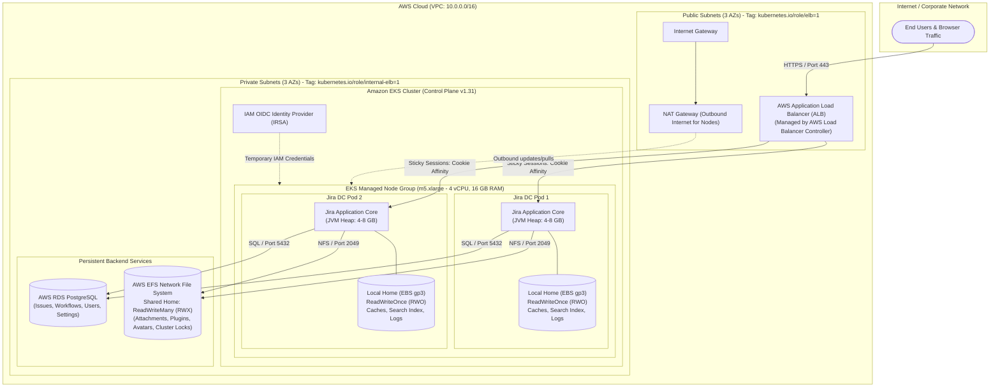

# Jira Data Center on AWS EKS & RDS Setup

Production-ready infrastructure architecture for deploying **Atlassian Jira Data Center** on **Amazon Elastic Kubernetes Service (EKS)** with **Amazon RDS PostgreSQL** and **Amazon EFS**.

---

## 1. Architecture Overview

Jira Data Center is an enterprise multi-node clustered application designed for high availability, fault tolerance, and load distribution. Unlike Jira Server, all cluster nodes (pods) run concurrently, requiring a shared relational database, shared file storage (`ReadWriteMany`), local block storage for indexing (`ReadWriteOnce`), and an Application Load Balancer with cookie-based sticky sessions.

### Architecture Diagram



---

## 2. Core Components Deep Dive

### 1. Worker Node Sizing (`m5.xlarge` vs `t3.medium`)
* **What it does**: Provides the compute virtual machines (EC2) where Jira container pods run.
* **Why it matters**:
  * AWS EKS defaults to `t3.medium` (2 vCPUs, 4 GB RAM) if unspecified.
  * Jira Data Center runs on a Java Virtual Machine (JVM). Atlassian specifies a minimum **4 GB to 8+ GB of RAM (Heap)** just for Jira, plus system reserves for Kubernetes (`kubelet`, `kube-proxy`, `aws-node`, `coredns`).
  * On `t3.medium`, pods will fail with **`Insufficient memory`** or crash with **`OOMKilled`** (Out of Memory, Exit code 137).
  * **Production Standard**: At least **`m5.xlarge`** (4 vCPU, 16 GiB RAM) or **`m5.2xlarge`** (8 vCPU, 32 GiB RAM).

### 2. Database: AWS RDS (PostgreSQL)
* **What it does**: Central relational database holding all Jira structured data (tickets, workflows, users, permissions, comments).
* **Why it matters**:
  * Jira Data Center does not include a built-in database for production.
  * All Jira pods in the cluster must read from and write to the same single database instance (with multi-AZ replication recommended).
  * Without RDS, the Jira Helm chart cannot initialize its database schema and will crash on startup (`DatabaseConnectionException`).

### 3. Storage Architecture: Local Home vs. Shared Home
Jira Data Center strictly separates local instance data from cluster-shared data:

| Storage Type | Mount Path | AWS Service | Access Mode | Purpose |
| :--- | :--- | :--- | :--- | :--- |
| **Local Home** | `/var/atlassian/application-data/jira` | **AWS EBS (gp3)** | `ReadWriteOnce` (RWO) | Node-specific Lucene search index, caches, JVM process logs. Fast block I/O. |
| **Shared Home** | `/var/atlassian/application-data/jira/shared` | **AWS EFS** | `ReadWriteMany` (RWX) | Shared files: attachments, avatars, installed plugins, and cluster lock files. |

#### What are CSI Drivers?
Kubernetes pods cannot natively provision AWS disks without "hardware drivers":
* **AWS EBS CSI Driver**: Automatically provisions and attaches EBS volumes when Jira requests local storage.
* **AWS EFS CSI Driver**: Automatically mounts the AWS EFS file system when Jira requests `ReadWriteMany` shared storage.

### 4. OIDC Provider & IRSA (IAM Roles for Service Accounts)
* **What it does**: Establishes OpenID Connect federated trust between EKS and AWS IAM.
* **Why it matters**:
  * Pods (like the EBS CSI driver, EFS CSI driver, and AWS Load Balancer Controller) need permission to call AWS APIs (e.g., create disks, mount EFS, create ALBs).
  * Rather than storing hardcoded AWS Access Keys in configuration files, **IRSA** injects short-lived, automatically rotated AWS IAM tokens directly into pods.

### 5. Ingress & AWS Load Balancer Controller (ALB)
* **What it does**: Manages an external Application Load Balancer to direct traffic to Jira pods running in private subnets.
* **Sticky Sessions**: In Jira Data Center, user sessions must stick to the same node for consecutive requests (cookie affinity) to prevent session loss or state desynchronization. The ALB handles this automatically.

### 6. Subnet Discovery Tags
Subnets must be tagged so Kubernetes controllers know how to route infrastructure:
* **Public Subnets**: `kubernetes.io/role/elb = "1"` (Tells AWS Load Balancer Controller where to deploy public ALBs).
* **Private Subnets**: `kubernetes.io/role/internal-elb = "1"` (For internal load balancers).

---

## 3. Jira DC Helm Chart Readiness Checklist

| Requirement | Description | Status | Next Steps |
| :---: | :--- | :---: | :--- |
| **VPC & Networking** | 3 Public Subnets, 3 Private Subnets, IGW, NAT GW | ✅ Ready | Add ALB discovery tags |
| **EKS Control Plane** | AWS EKS Cluster v1.31 | ✅ Ready | - |
| **Node Sizing** | EC2 instances with >= 16 GB RAM | ⚠️ Update Needed | Set `instance_types = ["m5.xlarge"]` in node group |
| **EKS OIDC Provider** | IAM OIDC provider for IRSA | ⏳ Pending | Add `aws_iam_openid_connect_provider` resource |
| **EBS CSI Driver** | Dynamic volume provisioning for `jira-local-home` | ⏳ Pending | Add `aws-ebs-csi-driver` EKS add-on + IAM role |
| **AWS RDS PostgreSQL** | Relational database for Jira DC | ⏳ Pending | Create RDS PostgreSQL module |
| **AWS EFS + EFS CSI** | Shared storage for `jira-shared-home` | ⏳ Pending | Create EFS file system + install EFS CSI driver |
| **Ingress & ALB** | Expose web UI with cookie sticky sessions | ⏳ Pending | Deploy AWS Load Balancer Controller |

---

## 4. Repository Structure

```text
jira-dc-eks-rds-setup/
├── README.md               # Infrastructure documentation and architecture diagram
├── main.tf                 # Root Terraform orchestrator
├── variables.tf            # Root input variables
├── provider.tf             # AWS provider configuration
├── locals.tf               # Local variables and naming conventions
├── env/
│   └── dev/
│       ├── terraform.tfvars # Dev environment variables
│       └── backend.tfvars   # S3 / DynamoDB remote state backend config
├── vpc/                    # VPC module (subnets, IGW, NAT GW, route tables)
│   ├── main.tf
│   ├── variables.tf
│   └── output.tf
├── iam/                    # IAM module (EKS cluster role, node group role)
│   ├── main.tf
│   ├── variables.tf
│   └── output.tf
└── eks/                    # EKS module (Cluster, Node Group)
    ├── main.tf
    ├── variables.tf
    └── output.tf
```

---

## 5. Usage & Deployment

### 1. Initialize Terraform with Backend
```bash
terraform init -backend-config="env/dev/backend.tfvars"
```

### 2. Validate Configuration
```bash
terraform validate
```

### 3. Review Execution Plan
```bash
terraform plan -var-file="env/dev/terraform.tfvars"
```

### 4. Deploy Infrastructure
```bash
terraform apply -var-file="env/dev/terraform.tfvars"
```
